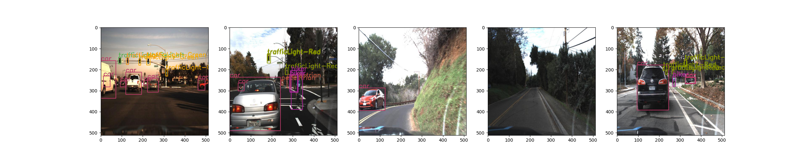
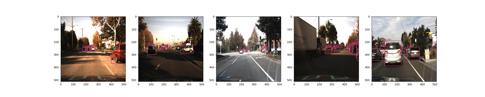
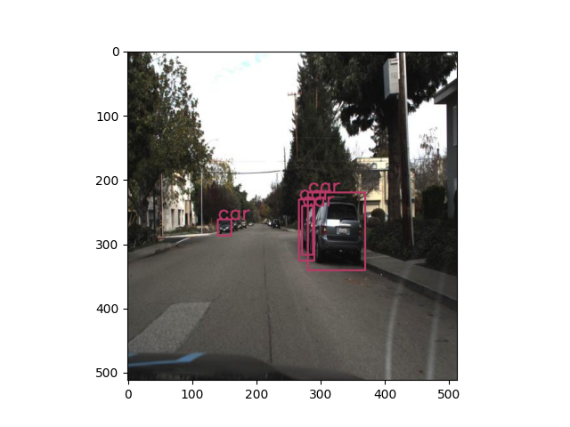
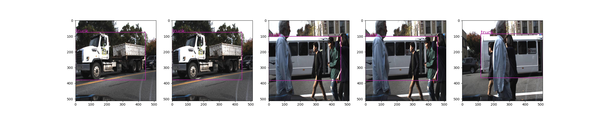
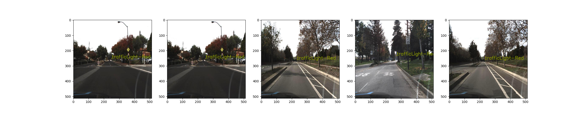
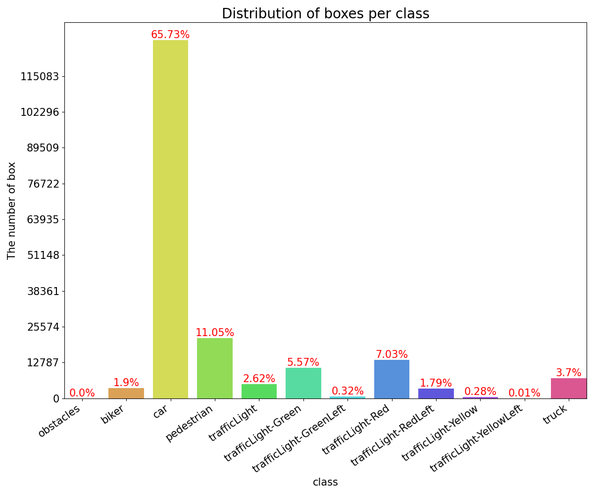
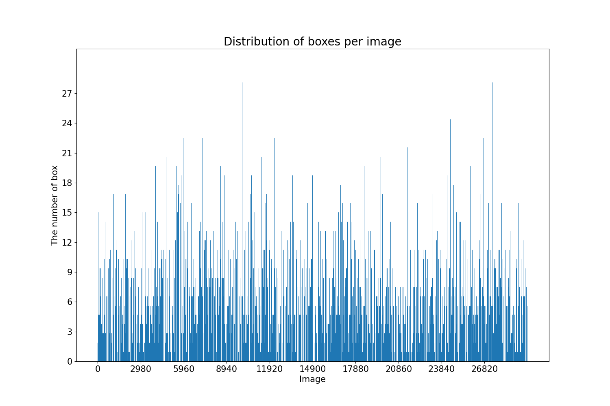
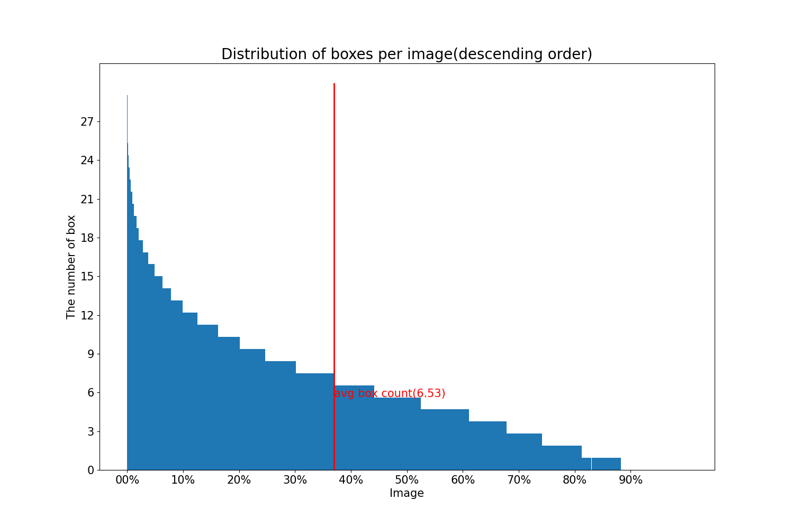
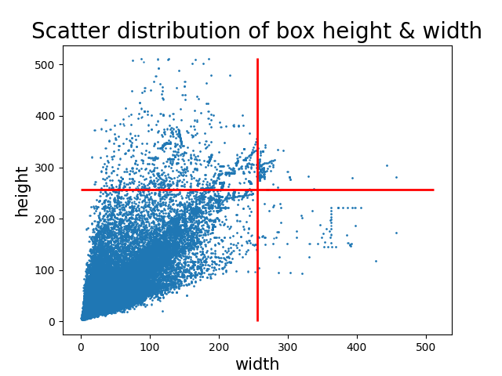

# Exploratory-data-analysis

- example dataset : [self-driving-car dataset](https://universe.roboflow.com/roboflow-gw7yv/self-driving-car/3)

## 0. Coco dataset analysis library
- start example

      # annotation file path
      anno_path = 'Self Driving Car.v3-fixed-small.coco/export/_annotations.coco.json'

      # rgb image directory path
      img_dir_path = 'Self Driving Car.v3-fixed-small.coco/export/'
      
      # instance generation
      coco = CocoAnalysis(anno_path, img_dir_path)

## 1. Image visualization
- Show 5 random images with annotation

      coco.show_random_img_all()
  

- Show 5 random images with only specific class annotation

      coco.show_random_img_class(2) # 2 <- class index
  

- Show an image of specific image id

      coco.show_img_id(0) # 0 <- image index
  

- Show big bounding boxes

      coco.show_big_annos() 
  

- Show small bounding boxes

      coco.show_small_annos()
  

## 2. Data chart
- Bar chart of the number of bounding box by class
      
      coco.show_bar_chart_box_by_class()
  

- Bar chart of the number of bounding box by image

      coco.show_bar_chart_box_by_image() 
  

- Bar chart of the number of bounding box descended by image 

      coco.show_bar_chart_box_by_image_descending()
  

- Scatter chart of bounding box height & width

      coco.show_scatter_chart_height_width_all()
  

## 3. Dataset edit

